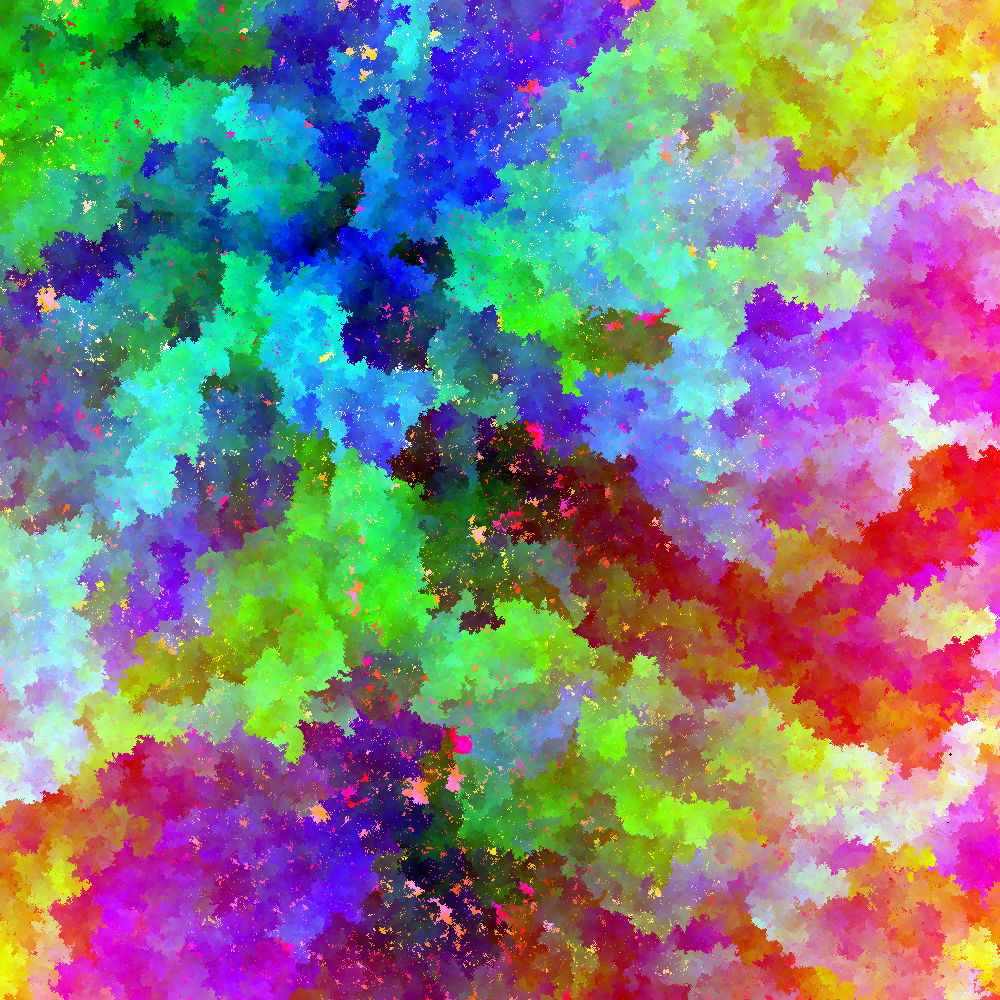

# AllRGB

Two tools for making images where every color is used exactly once — none
repeated, none missing.

## The two tools

### `allrgb.py` — sort and remap

Takes an **input image** and reassigns every pixel's color, by a global
HSV sort, so the result uses all 16,777,216 sRGB colors exactly once. The
input supplies the structure; the palette becomes the whole color space.
Output is always 4096×4096. Fast — a single sort, about 30 seconds.

    .venv/bin/python allrgb.py generate -i photo.jpg -o allrgb.png
    .venv/bin/python allrgb.py test -i allrgb.png      # verify every color once

### `allcolors.py` — grow from a seed

Generates an image **from scratch** by neighbor-coherent growth: shuffle
the palette, then place each color, one at a time, at the empty pixel
where it best matches its already-placed neighbors. The image blooms
outward from its seed(s).

The palette is `width × height` colors, taken as a near-cubic grid of the
RGB cube (1080×1080 → a 100×108×108 grid), so any size works.

    # a still
    .venv/bin/python allcolors.py --width 1000 --height 1000 -o art.png

    # a growth animation — a video file extension switches modes
    .venv/bin/python allcolors.py --width 1080 --height 1080 -o growth.mp4

Knobs:

| flag | effect |
|------|--------|
| `--order shuffle` | random palette order — speckly, radial **starburst** (default) |
| `--order walk` | smooth order — soft organic **cloud** |
| `--order hue` | hue-sorted — rainbow flow |
| `--seeds N` | number of bloom centers |
| `--average` | match the average of the neighbors, not the single best |
| `--frames N`, `--fps N` | animation frame count / rate (video output only) |
| `--seed S` | fix the random stream for reproducible output |

*`--order walk` at 1000×1000: 1,000,000 colors, each used exactly once.
Produced with `allcolors.py --width 1000 --height 1000 --order walk --seeds 8 --seed 1`.*

## Setup

Python 3, in a virtual environment:

    python3 -m venv .venv
    .venv/bin/pip install -r requirements.txt
    .venv/bin/pip install imageio-ffmpeg     # only needed for video output

## Notes

- `allrgb.py` scales to the full 16.7M-color / 4096×4096 image. The
  `allcolors.py` growth does not: it is practical up to ~1000×1000 in a
  few minutes, while a 4096×4096 still takes a few hours. `--order walk`
  is the slowest of the three orders.
- `allcolors.cs` is the original C# the growth algorithm was ported from.
- `tests/` holds a check for `allrgb.py`: `.venv/bin/python -m unittest`.

## License and credit

This repository is **mixed-license** — note this before redistributing.

- `allrgb.py`, `util.py`, `setup.py`, and `tests/` are the original
  AllRGB project by **Dan Kaplun** (dbkaplun), MIT-licensed — see
  `LICENSE`.
- `allcolors.cs` is **fejesjoco**'s C#, from his post "All RGB colors in
  one image" (March 2, 2014) — his answer to
  [Code Golf Stack Exchange #22144](https://codegolf.stackexchange.com/questions/22144/images-with-all-colors).
  He released it under the **GPL**.
- `allcolors.py` is a Python translation of that C#. A translation is a
  derivative work, so it is **GPL** as well and cannot be relicensed MIT.

The MIT `LICENSE` file applies to the `allrgb.py` side only; the
`allcolors.*` files are GPL.
